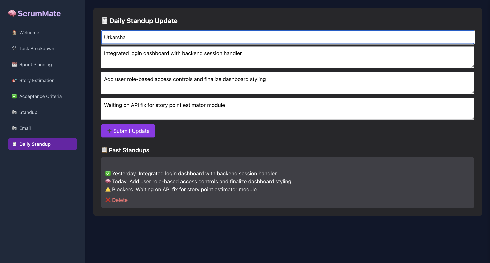
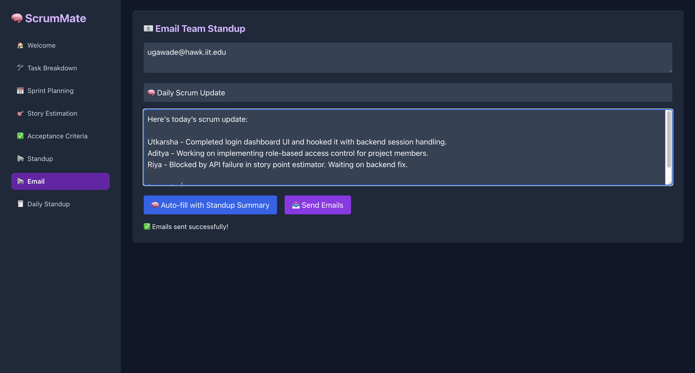
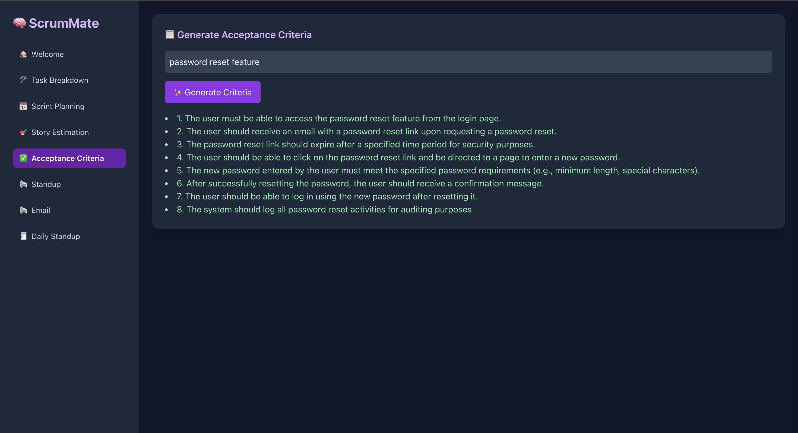
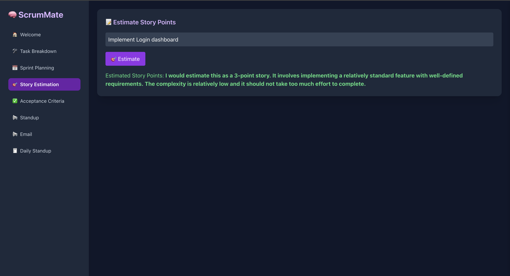
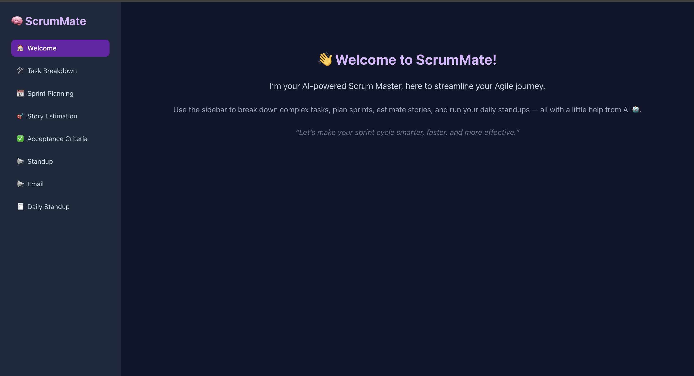
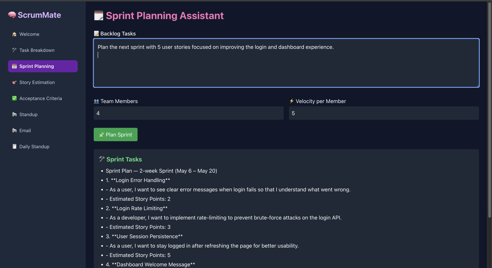
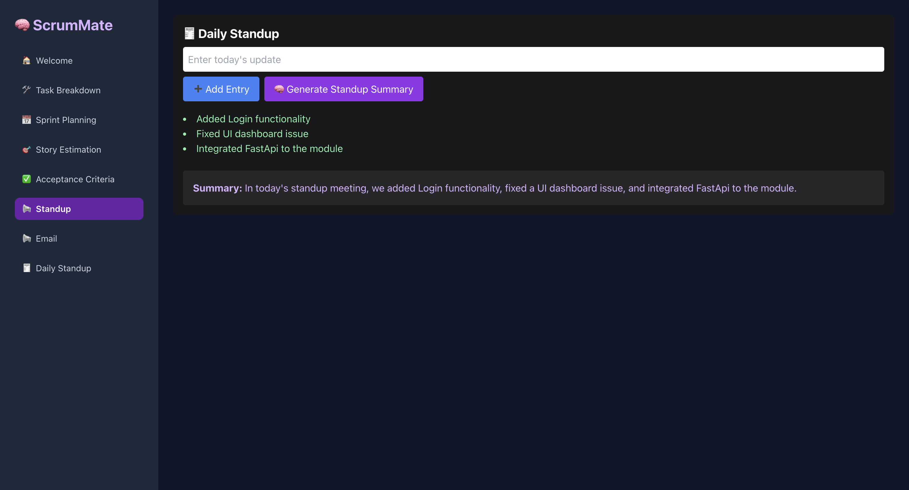

# 🚀 ScrumMate

ScrumMate is an AI-powered Agile assistant that helps teams automate sprint planning, daily standups, and story point estimations. It integrates a FastAPI backend with a React + Tailwind CSS frontend.

---

## 📁 Project Structure

ScrumMate/
├── backend/ # FastAPI backend
├── client/ # React frontend
├── assets/ # Static assets (images, logos, etc.)
├── requirements.txt # Python dependencies
├── package.json # React dependencies

`
---

## ⚙️ Backend Setup (FastAPI)

### Prerequisites
- Python 3.9+
- `virtualenv` (optional but recommended)

### Setup Instructions

```bash
# Navigate to backend
cd backend

# Create virtual environment
python -m venv .venv
source .venv/bin/activate   # on Windows use: .venv\Scripts\activate

# Install dependencies
pip install -r ../requirements.txt

# Run the FastAPI server
uvicorn main:app --reload
```

🎨 Frontend Setup (React)
Prerequisites
Node.js 18+

npm or yarn

Setup Instructions
```
# Navigate to client
cd client

# Install dependencies
npm install

# Start the dev server
npm start
```
React app will be running at: http://localhost:3000

🧠 Features
🧾 Daily standup submission + email summaries

📈 Sprint planning with AI task breakdown

🧮 Story point estimation using GPT

📊 GitHub & JIRA integration (WIP)

☁️ MongoDB & SendGrid support

📌 Environment Variables
Backend:

OPENAI_API_KEY

MONGODB_URI

SENDGRID_API_KEY

Frontend:

Create .env file in /client with:
```
REACT_APP_API_URL=http://localhost:8000
```

---

## 📸 Screenshots

### 🧾 Standup Update


### 📬 Email Summary Page


### 📋 Acceptance Criteria Generator


### 🎯 Story Points Estimator


### 🏠 Homepage


### 🗓 Sprint Planning View


### 📊 Standups Dashboard


---

🛠️ Author
Utkarsha Gawade.
